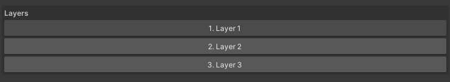
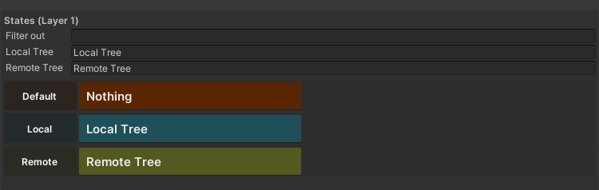
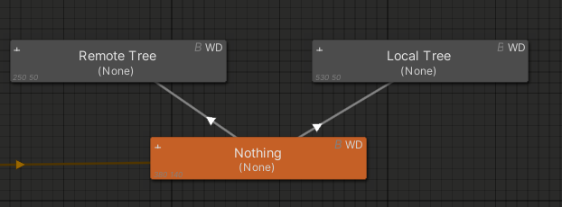
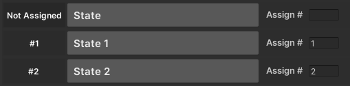
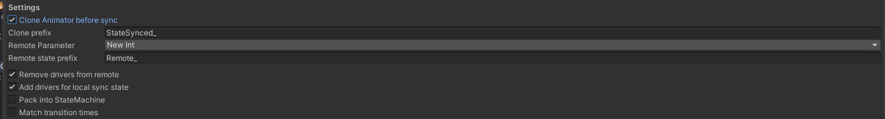
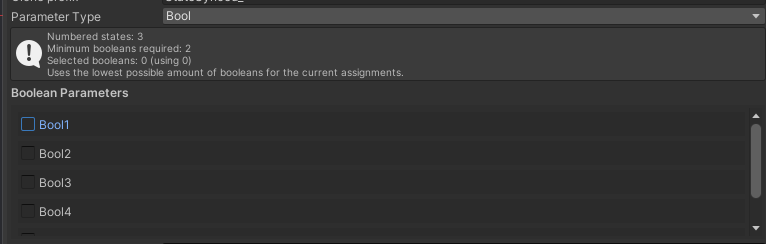

### 1. Getting started

- First, grab the Animator Controller you want to work with. Then select the layer containing the states you want to sync.

---

### 2. Setting your local/remote starts

- The first thing you will see is **Filter out**. This input is useful for filtering out specific states, for example `Remote_`.
- Next, there is a `Local tree` and `Remote tree` input. These define your layer starting points for `IsLocal == True/False`.

---

### 3. Assigning states to numbers

- By default, if your state name ends with a number (for example, `State name 1`. Note: It does require the spaced number not `State name1`), the plugin will automatically assign that number to the state. You can change it by editing the number.
- If your state does not have a number, you can assign any number to it (as long as it doesn’t conflict with another state).
- Be careful: assigning the same number to multiple states will cause a conflict.

---

### 4. Settings

- `Clone Animator before sync` will clone your Animator using a prefix `StateSync_` before doing it's logic so you always have a clean version.
- `Parameter Type` Uses either Int or Boolean [(See below)](#boolean-mode)
- `Remote Parameter` is the parameter you want to use for syncing. **Currently locked to Int only.**
- `Remote state prefix` adds a prefix to the front of newly cloned states (for example, `Remote_State 1`).
- `Remove Drivers from remote` removes parameter drivers that are cloned from the original states.
- `Add drivers to local states` adds a driver to all assigned states based on their number if you don’t already have parameter drivers set up. **This also scans your drivers to make sure it doesn’t already exist.**
- `Pack into StateMachine` packs your `Remote tree` and `Cloned States` into a sub-state machine.
- `Match transition times` clones the transition time from one state to another when enabled. For example, if State 1 has a transition time to State 2, it copies that transition time only for the transition between those states.

---
### Boolean mode

Boolean mode uses multiple boolean parameters to represent a single number in binary.
Each selected boolean is a bit. The first checkbox is the lowest bit (bit 0), the next is bit 1, and so on.
When a state is assigned a number, that number is converted to binary and each bit is written to the matching boolean.

Example with 3 booleans (Bool1, Bool2, Bool3):
- State number 1 = binary 001 -> Bool1 = true, Bool2 = false, Bool3 = false
- State number 5 = binary 101 -> Bool1 = true, Bool2 = false, Bool3 = true

The tool calculates the minimum number of booleans needed based on your highest assigned number.
If it needs 8 or more booleans (or you select 8+), it will warn you that using an int is usually easier.

