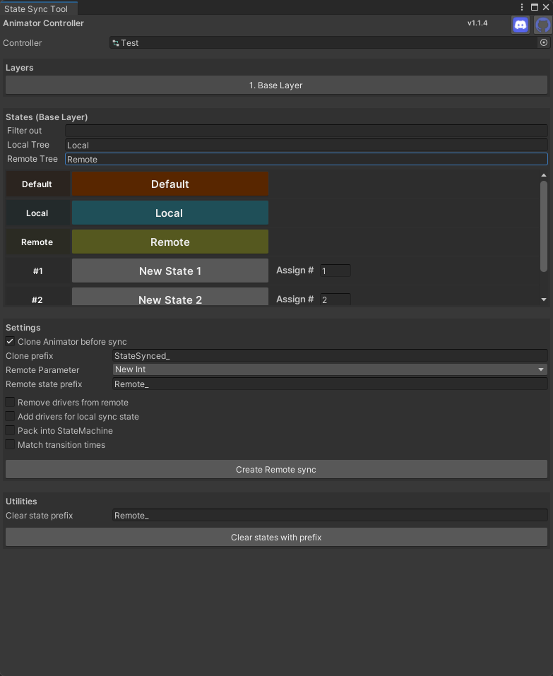

State Sync Tool connects locally driven animator states to remote states using parameter drivers, keeping remote playback in lockstep so it never desyncs. It also offers a handful of settings and utilities to streamline connecting states together.

Grab it here: https://kebolder.github.io/Kebolder-VPM-Listing/

See the how-to guide: [How-to](Documentation/HowTo.md)

---

